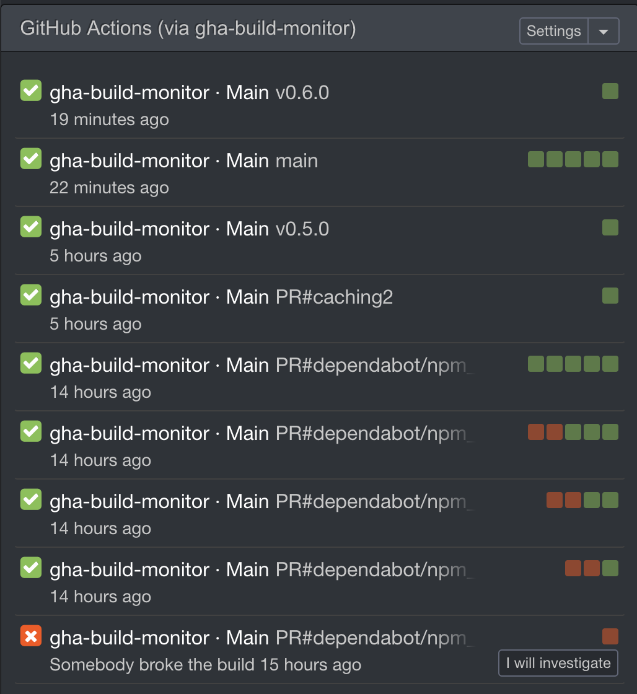
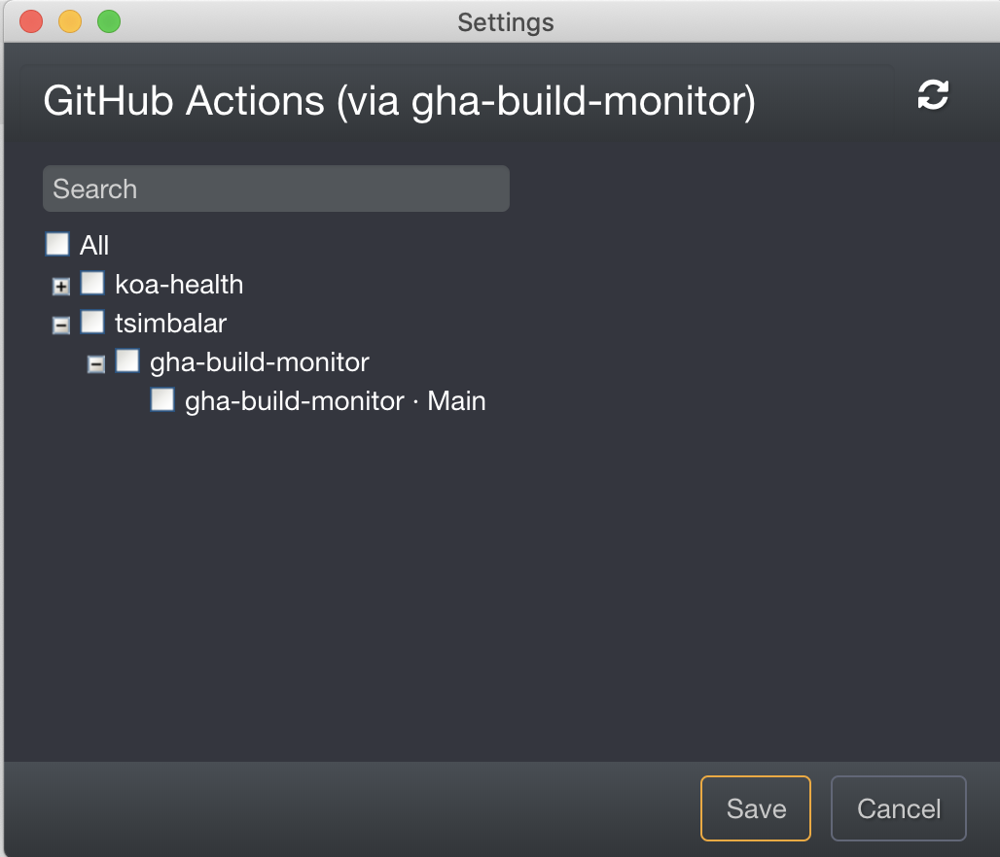

# gha-build-monitor

Adapter to give access to GitHub Actions status via the [CatLight Protocol](https://github.com/catlightio/catlight-protocol)



## How To

To use `gha-build-monitor` to monitor your GitHub Actions workflows, follow these steps :

### 1. Start the "proxy" locally

```
docker run --name gha-build-monitor -d -p 9901:9901 --restart unless-stopped ghcr.io/tsimbalar/gha-build-monitor
```

Open `http://localhost:9901/` in a browser to check that the server is up and running.

### 2. Create a GitHub Access Token

You need a Personal Access Token (PAT) with the `repo` scope so that we can retrieve status information of your GitHub Actions.

1. Go to https://github.com/settings/tokens/new?scopes=repo&description=gha-build-monitor
2. Create a token with the scope `repo`
3. Copy the token

### 3. Connecting Catlight to `gha-build-monitor`

In CatLight, you need to :

1. Add new connection
2. choose "CatLight-compatible"
3. Log in with :

- Url : `http://localhost:9901/builds`
- "Use token"
- paste your token

4. Connect


### 4. Choose the workflows you want to track

1. Select the GitHub Actions workflows you want to monitor
2. Connect



### 5. Profit

Get notified about new builds, failing builds etc


## FAQ
### How to upgrade

If you followed the previous instructions, you should be able to run those commands : 

```bash
docker stop gha-build-monitor
docker rm gha-build-monitor
docker pull ghcr.io/tsimbalar/gha-build-monitor:latest
docker run --name gha-build-monitor -d -p 9901:9901 --restart unless-stopped ghcr.io/tsimbalar/gha-build-monitor
```

---
## Roadmap

This is still an early version (`v0.*`).

Here are some things that will probably be added before v1 :

- retrieving authors/contributors of each workflow run

